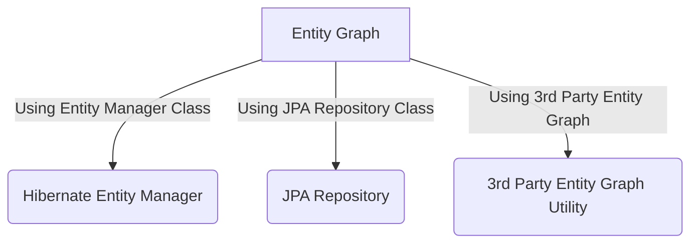
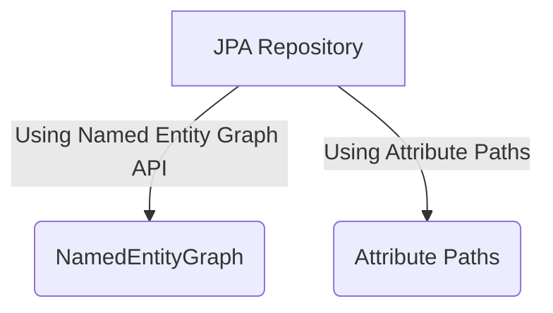

# Hibernate Entity Graph
 In Hibernate/JPA we face N+1 Problem. First we will see what is the N+1 Problem.
 
 In order to find, what is N+1 Problem Please go through the below stackoverflow link
 
 https://stackoverflow.com/questions/32453989/what-is-the-solution-for-the-n1-issue-in-jpa-and-hibernate?noredirect=1&lq=1
   
 We can fix N+1 select problem by using Entity Graphs provided by JPA 2.1. we can achieve it in the following ways. 
 
 - Using Entity Manager
 - Using JPA Repository
 - Using 3rd Party Entity Graph Utility
  



In this example we will use `Hibernate Entity Manager` to solve N+1 problem.



### DB Design


## Without Entity Graph

### Repository Class
```java

@Repository
public interface AuthorRepository extends JpaRepository<Author, Integer> {

     @Query("SELECT author FROM Author author WHERE author.id = :id ")
	 Author findAuthor(@Param("id")  Integer id);
}

```
### Test case 
```java
	Author author = authorRepository.findAuthor(1);
	log.info(author.getFirstName()+" "+author.getLastName()+" wrote "+author.getBooks().size()+" books.");
	Set<Book> books = author.getBooks(); 
	 for(Book book: books) {
		log.info(book.getPublisher()); 
	 }
	
```
We can notice when I tried to access author, books and publisher, it issues 3 queries to fetch the data.

```log

Hibernate: 
    select
        author0_.`id` as id1_0_,
        author0_.`first_name` as first_na2_0_,
        author0_.`last_name` as last_nam3_0_,
        author0_.`version` as version4_0_ 
    from
        `author` author0_ 
    where
        author0_.`id`=?
Hibernate: 
    select
        books0_.`author_id` as author_i2_2_0_,
        books0_.`book_id` as book_id1_2_0_,
        book1_.`id` as id1_1_1_,
        book1_.`publisher_id` as publishe5_1_1_,
        book1_.`publishing_date` as publishi2_1_1_,
        book1_.`title` as title3_1_1_,
        book1_.`version` as version4_1_1_ 
    from
        `book_author` books0_ 
    inner join
        `book` book1_ 
            on books0_.`book_id`=book1_.`id` 
    where
        books0_.`author_id`=?
20:18:16.222  INFO 11160 ---[main] .t.m.r.TestJPARepositoryNamedEntityGraph : Joshua Bloch wrote 1 books.
Hibernate: 
    select
        publisher0_.`id` as id1_3_0_,
        publisher0_.`name` as name2_3_0_,
        publisher0_.`version` as version3_3_0_ 
    from
        `publisher` publisher0_ 
    where
        publisher0_.`id`=?
20:18:16.232  INFO 11160 ---[main] .t.m.r.TestJPARepositoryNamedEntityGraph : Publisher name: Addison-Wesley Professional

```

## Named Entity Graph

### Entity Class (declaring Named Entity Graph as below)

```java
@Entity
@Table(name = "author")
@NamedEntityGraph(name = "graph.author.books.publisher", 
	attributeNodes = @NamedAttributeNode(value = "books", subgraph = "books"),
	subgraphs = @NamedSubgraph(name = "books", attributeNodes = @NamedAttributeNode("publisher"))    )

@NamedEntityGraph(name = "graph.author.books", attributeNodes = @NamedAttributeNode(value = "books"))

public class Author {

	@Id
	@GeneratedValue(strategy = GenerationType.IDENTITY)
	private Integer id;

	@Version
	private Integer version;

	@Column(name = "first_name")
	private String firstName;

	@Column(name = "last_name")
	private String lastName;

	@ManyToMany(mappedBy="authors",fetch = FetchType.LAZY)
	private Set<Book> books = new HashSet<Book>();

}

@Entity
@Table(name = "book")
public class Book {
	
	@Id
	@GeneratedValue(strategy = GenerationType.IDENTITY)
	private Integer id;

	@Version
	private Integer version;

	private String title;

	@Temporal(TemporalType.DATE)
	@Column(name = "publishing_date")
	private Date publishingDate;

	@ManyToOne(fetch = FetchType.LAZY)
	@JoinColumn(name="publisher_id")
	private Publisher publisher;

	@ManyToMany
	@JoinTable(
		      name="book_author",
		      joinColumns={@JoinColumn(name="book_id", referencedColumnName="id")},
		      inverseJoinColumns={@JoinColumn(name="author_id", referencedColumnName="id")})
	private Set<Author> authors = new HashSet<Author>();
	
}

@Entity
@Table(name = "publisher")
public class Publisher {

	@Id
	@GeneratedValue(strategy = GenerationType.IDENTITY)
	private Integer id;

	@Version
	private Integer version;

	private String name;

	@OneToMany(mappedBy = "publisher")
	private Set<Book> books = new HashSet<Book>();
	
}		

```

In below example we are using `@EntityGraph` and value attribute `graph.author.books` to get entity graph api. 
It will load only Book objects but not publisher associate with books

### Repository Class
```java

@Repository
public interface AuthorRepository extends JpaRepository<Author, Integer> {

     @EntityGraph(value ="graph.author.books" , type = EntityGraphType.LOAD)
	 @Query("SELECT author FROM Author author WHERE author.id = :id ")
	 Author findNamedEntityGraphBooksAndLoad(@Param("id")  Integer id);
	
}

```
### Test case
```java

	@Test
	public void findNamedEntityGraphBooksAndLoad() {
		log.info("... findNamedEntityGraphBooksAndLoad ...");		
		Author author = authorRepository.findNamedEntityGraphBooksAndLoad(1);
		displayAuthor(author);
	}
	
	protected void displayAuthor(Author author) {
		log.info(author.getFirstName()+" "+author.getLastName()+" wrote "+author.getBooks().size()+" books.");
		Set<Book> books = author.getBooks(); 
		 for(Book book: books) {
			log.info(book.getPublisher()); 
		 }
	}
	
```

we can notice that it issued only 2 queries to fetch data. This is because we included books as part of graph.

```log

Hibernate: 
    select
        author0_.`id` as id1_0_0_,
        book2_.`id` as id1_1_1_,
        author0_.`first_name` as first_na2_0_0_,
        author0_.`last_name` as last_nam3_0_0_,
        author0_.`version` as version4_0_0_,
        book2_.`publisher_id` as publishe5_1_1_,
        book2_.`publishing_date` as publishi2_1_1_,
        book2_.`title` as title3_1_1_,
        book2_.`version` as version4_1_1_,
        books1_.`author_id` as author_i2_2_0__,
        books1_.`book_id` as book_id1_2_0__ 
    from
        `author` author0_ 
    left outer join
        `book_author` books1_ 
            on author0_.`id`=books1_.`author_id` 
    left outer join
        `book` book2_ 
            on books1_.`book_id`=book2_.`id` 
    where
        author0_.`id`=?
20:26:40.480  INFO 13376 --- [           main] .t.m.r.TestJPARepositoryNamedEntityGraph : Joshua Bloch wrote 1 books.
Hibernate: 
    select
        publisher0_.`id` as id1_3_0_,
        publisher0_.`name` as name2_3_0_,
        publisher0_.`version` as version3_3_0_ 
    from
        `publisher` publisher0_ 
    where
        publisher0_.`id`=?
20:26:40.491  INFO 13376 --- [           main] .t.m.r.TestJPARepositoryNamedEntityGraph : Publisher name: Addison-Wesley Professional


```

In below example we are using `@EntityGraph` and value attribute `graph.author.books.publisher` to get entity graph api. 
It will load Book objects as well as publisher associate with books

### Repository Class
```java

@Repository
public interface AuthorRepository extends JpaRepository<Author, Integer> {

     @EntityGraph(value ="graph.author.books.publisher",type = EntityGraphType.LOAD)
	 @Query("SELECT author FROM Author author WHERE author.id = :id ")
	 Author findNamedEntityGraphBooksPublisherAndLoad(@Param("id") Integer id);
	
}

```
### Test case

```java

	@Test
	public void findNamedEntityGraphBooksPublisherAndLoad() {
		log.info("... findNamedEntityGraphBooksPublisherAndLoad ...");		
		Author author = authorRepository.findNamedEntityGraphBooksPublisherAndLoad(1);
		displayAuthor(author);
	}
	
	protected void displayAuthor(Author author) {
		log.info(author.getFirstName()+" "+author.getLastName()+" wrote "+author.getBooks().size()+" books.");
		Set<Book> books = author.getBooks(); 
		 for(Book book: books) {
			log.info(book.getPublisher()); 
		 }
	}
	
```
we can notice that it issued only one query to fetch all data. This is because we included books and publisher as part of graph.

```log
Hibernate: 
    select
        author0_.`id` as id1_0_0_,
        book2_.`id` as id1_1_1_,
        publisher3_.`id` as id1_3_2_,
        author0_.`first_name` as first_na2_0_0_,
        author0_.`last_name` as last_nam3_0_0_,
        author0_.`version` as version4_0_0_,
        book2_.`publisher_id` as publishe5_1_1_,
        book2_.`publishing_date` as publishi2_1_1_,
        book2_.`title` as title3_1_1_,
        book2_.`version` as version4_1_1_,
        books1_.`author_id` as author_i2_2_0__,
        books1_.`book_id` as book_id1_2_0__,
        publisher3_.`name` as name2_3_2_,
        publisher3_.`version` as version3_3_2_ 
    from
        `author` author0_ 
    left outer join
        `book_author` books1_ 
            on author0_.`id`=books1_.`author_id` 
    left outer join
        `book` book2_ 
            on books1_.`book_id`=book2_.`id` 
    left outer join
        `publisher` publisher3_ 
            on book2_.`publisher_id`=publisher3_.`id` 
    where
        author0_.`id`=?
20:30:11.256  INFO 8560 --- [           main] .t.m.r.TestJPARepositoryNamedEntityGraph : Joshua Bloch wrote 1 books.
20:30:11.257  INFO 8560 --- [           main] .t.m.r.TestJPARepositoryNamedEntityGraph : Publisher name: Addison-Wesley Professional

```

## Attribute Paths

### Entity Class

```java
@Entity
public class Author {

	@Id
	@GeneratedValue(strategy = GenerationType.IDENTITY)
	private Integer id;

	@Version
	private Integer version;

	@Column(name = "first_name")
	private String firstName;

	@Column(name = "last_name")
	private String lastName;

	@ManyToMany(mappedBy="authors",fetch = FetchType.LAZY)
	private Set<Book> books = new HashSet<Book>();


}

@Entity
@Table(name = "book")
public class Book {
	
	@Id
	@GeneratedValue(strategy = GenerationType.IDENTITY)
	private Integer id;

	@Version
	private Integer version;

	private String title;

	@Temporal(TemporalType.DATE)
	@Column(name = "publishing_date")
	private Date publishingDate;

	@ManyToOne(fetch = FetchType.LAZY)
	@JoinColumn(name="publisher_id")
	private Publisher publisher;

	@ManyToMany
	@JoinTable(
		      name="book_author",
		      joinColumns={@JoinColumn(name="book_id", referencedColumnName="id")},
		      inverseJoinColumns={@JoinColumn(name="author_id", referencedColumnName="id")})
	private Set<Author> authors = new HashSet<Author>();
	
}

@Entity
@Table(name = "publisher")
public class Publisher {

	@Id
	@GeneratedValue(strategy = GenerationType.IDENTITY)
	private Integer id;

	@Version
	private Integer version;

	private String name;

	@OneToMany(mappedBy = "publisher")
	private Set<Book> books = new HashSet<Book>();
	
}		

```

### Repository Class
In below example we can set attributes paths. `@EntityGraph(attributePaths = {"books"},type = EntityGraphType.LOAD)`
It will load only Book objects but not publisher associate with books

```java

@Repository
public interface AuthorRepository extends JpaRepository<Author, Integer> {

     @EntityGraph(attributePaths = {"books"},type = EntityGraphType.LOAD)
	 @Query("SELECT author FROM Author author WHERE author.id = :id ")
	 Author findOnlyBooksAndLoad(@Param("id")  Integer id);
	
}

```

### Testing Here

```java

	@Test
	public void findOnlyBooksAndLoad() {
		log.info("... findOnlyBooksAndLoad ...");		
		Author author = authorRepository.findOnlyBooksAndLoad(1);
		displayAuthor(author);
	}
	
	protected void displayAuthor(Author author) {
		log.info(author.getFirstName()+" "+author.getLastName()+" wrote "+author.getBooks().size()+" books.");
		Set<Book> books = author.getBooks(); 
		 for(Book book: books) {
			log.info(book.getPublisher()); 
		 }
	}

```
```log
  Hibernate: 
    select
        author0_.`id` as id1_0_0_,
        book2_.`id` as id1_1_1_,
        author0_.`first_name` as first_na2_0_0_,
        author0_.`last_name` as last_nam3_0_0_,
        author0_.`version` as version4_0_0_,
        book2_.`publisher_id` as publishe5_1_1_,
        book2_.`publishing_date` as publishi2_1_1_,
        book2_.`title` as title3_1_1_,
        book2_.`version` as version4_1_1_,
        books1_.`author_id` as author_i2_2_0__,
        books1_.`book_id` as book_id1_2_0__ 
    from
        `author` author0_ 
    left outer join
        `book_author` books1_ 
            on author0_.`id`=books1_.`author_id` 
    left outer join
        `book` book2_ 
            on books1_.`book_id`=book2_.`id` 
    where
        author0_.`id`=?
20:39:38.277  INFO 6384 --- [           main] c.t.m.r.TestJPARepositoryEntityGraph     : Joshua Bloch wrote 1 books.
Hibernate: 
    select
        publisher0_.`id` as id1_3_0_,
        publisher0_.`name` as name2_3_0_,
        publisher0_.`version` as version3_3_0_ 
    from
        `publisher` publisher0_ 
    where
        publisher0_.`id`=?
20:39:38.286  INFO 6384 --- [           main] c.t.m.r.TestJPARepositoryEntityGraph     : Publisher name: Addison-Wesley Professional
  
```

In below example we can set attributes paths. ` @EntityGraph(attributePaths = {"books","books.publisher"},type = EntityGraphType.LOAD)`
Author class has property name `books` and Book class has property name `publisher` 
It will load Book objects as well as publisher associate with books

```java

@Repository
public interface AuthorRepository extends JpaRepository<Author, Integer> {

     @EntityGraph(attributePaths = {"books","books.publisher"},type = EntityGraphType.LOAD)
	 @Query("SELECT author FROM Author author WHERE author.id = :id ")
	 Author findBooksPublisherAndLoad(@Param("id") Integer id);
	
}

```

```java

	@Test
	public void findBooksPublisherAndLoad() {
		log.info("... findBooksPublisherAndLoad ...");		
		Author author = authorRepository.findBooksPublisherAndLoad(1);
		displayAuthor(author);
	}
	
	protected void displayAuthor(Author author) {
		log.info(author.getFirstName()+" "+author.getLastName()+" wrote "+author.getBooks().size()+" books.");
		Set<Book> books = author.getBooks(); 
		 for(Book book: books) {
			log.info(book.getPublisher()); 
		 }
	}

```
```log
Hibernate: 
    select
        author0_.`id` as id1_0_0_,
        book2_.`id` as id1_1_1_,
        publisher3_.`id` as id1_3_2_,
        author0_.`first_name` as first_na2_0_0_,
        author0_.`last_name` as last_nam3_0_0_,
        author0_.`version` as version4_0_0_,
        book2_.`publisher_id` as publishe5_1_1_,
        book2_.`publishing_date` as publishi2_1_1_,
        book2_.`title` as title3_1_1_,
        book2_.`version` as version4_1_1_,
        books1_.`author_id` as author_i2_2_0__,
        books1_.`book_id` as book_id1_2_0__,
        publisher3_.`name` as name2_3_2_,
        publisher3_.`version` as version3_3_2_ 
    from
        `author` author0_ 
    left outer join
        `book_author` books1_ 
            on author0_.`id`=books1_.`author_id` 
    left outer join
        `book` book2_ 
            on books1_.`book_id`=book2_.`id` 
    left outer join
        `publisher` publisher3_ 
            on book2_.`publisher_id`=publisher3_.`id` 
    where
        author0_.`id`=?
20:42:34.904  INFO 9508 --- [           main] c.t.m.r.TestJPARepositoryEntityGraph     : Joshua Bloch wrote 1 books.
20:42:34.905  INFO 9508 --- [           main] c.t.m.r.TestJPARepositoryEntityGraph     : Publisher name: Addison-Wesley Professional


```


